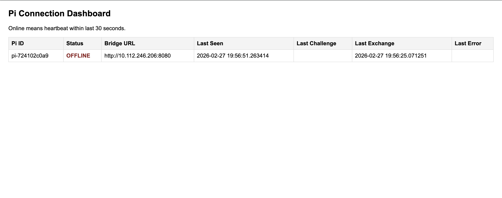
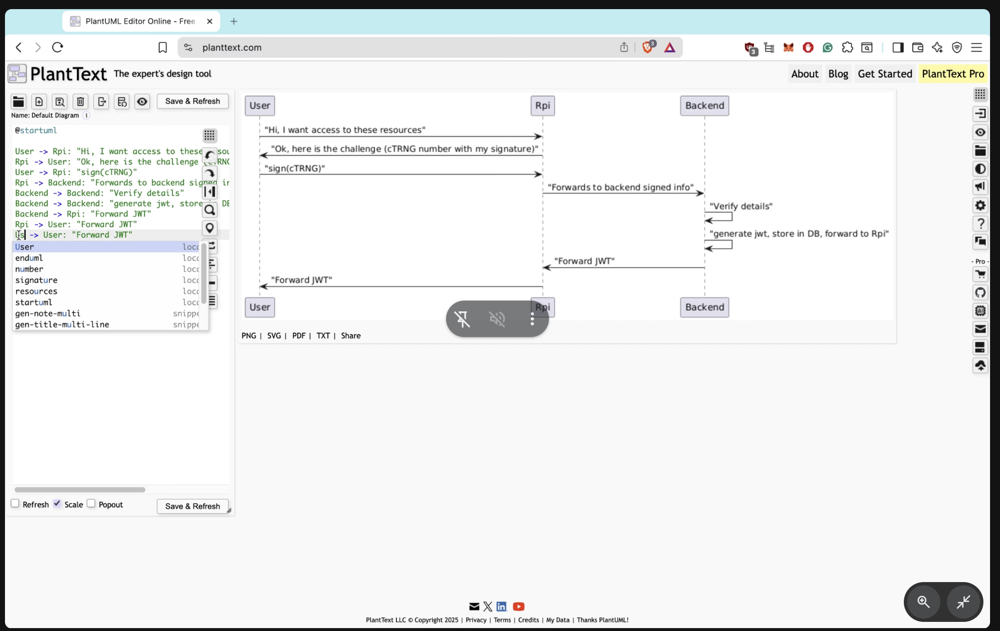

# JWT Verification (Mentor-Aligned Presence Flow)

This repo implements the mentor flow for proof-of-presence with a Pi challenge and backend JWT issuance.

## Sequence (Implemented)

1. User/App -> Pi bridge: request access/challenge.
2. Pi bridge -> User/App: return fresh challenge (`cTRNG`) + Pi signature.
3. User/App: sign challenge locally with user key.
4. User/App -> Backend: send `{user_id, pi_id, challenge, pi_signature, user_signature}`.
5. Backend: verify Pi signature + user signature, issue/store JWT session.
6. Backend -> User/App: return JWT; app proceeds with verified flow.

## Repo Structure

- `jwt-flask/`: Flask backend (JWT issue/verify, admin dashboard, Pi presence registry)
- `rpi/`: Pi bridge + heartbeat + key registration + Orbitport cTRNG integration
- `user/`: legacy/testing client artifacts

## Backend Setup (Local)

```bash
cd jwt-flask
pip install -r requirements.txt
python3 app.py
```

### Required Backend Env Vars (Already set in Render)

- `REQUIRE_USER_SIGNATURE=true`
- `USER1_ED25519_PUBLIC_KEY_HEX=<hex public key used by app's user signer>`

### Common Optional Backend Env Vars (Already set in Render)

- `DATABASE_URL=<postgres url>` (recommended on Render)
- `ADMIN_TOKEN=<token>` (protect `/admin` and `/admin/pis`)
- `PI_REGISTRATION_TOKEN=<token>` (protect Pi key registration endpoint)
- `JWT_EXP_SECONDS=<seconds>`

## Render Deployment Notes (Backend)

If deploying only `jwt-flask` as service root:

- Build command: `pip install -r requirements.txt`
- Start command: `gunicorn --bind 0.0.0.0:$PORT "app:create_app()"`

Ensure env vars above are set in Render.

## Pi Setup (New Pi / Teammate)

```bash
git clone https://github.com/spacecomputer-capstone/jwt-verification.git
cd jwt-verification/rpi
pip install -r requirements.txt
```

Install Node + dependencies for Orbitport cTRNG helper:

```bash
sudo apt update
sudo apt install -y nodejs npm
npm install
```

Generate Pi keypair (one-time):

```bash
mkdir -p keys
openssl genrsa -out keys/pi_private.pem 2048
openssl rsa -in keys/pi_private.pem -pubout -out keys/pi_public.pem
```

Set Orbitport credentials in same shell (or profile):

```bash
export OP_CLIENT_ID="..."
export OP_CLIENT_SECRET="..."
```

Run Pi service:

```bash
python3 pi_client.py
```

What this does automatically:

- auto-generates/persists a stable Pi ID in `rpi/.pi_id` (if not set)
- starts local Pi bridge (`/health`, `/challenge`)
- heartbeats to backend (`/presence/pi/heartbeat`)
- registers Pi public key to backend (`/presence/pi/register`)

If backend uses registration auth, set matching token in Pi env/config:

- `PI_REGISTRATION_TOKEN=<same token as backend>`

## cTRNG Behavior and Latency Stability

`/challenge` uses Orbitport cTRNG via Node helper (`rpi/scripts/get_ctrng.mjs`).

To keep challenge timing consistent, the Pi bridge now:

- pre-fills a cache of signed challenges in a background thread
- serves `/challenge` from cache first (fast path)
- falls back to local secure randomness if Orbitport is slow/unavailable (default enabled)

Useful runtime knobs:

- `CTRNG_TIMEOUT_SECONDS` (default `1.2`)
- `CHALLENGE_CACHE_SIZE` (default `4`)
- `CHALLENGE_MAX_AGE_SECONDS` (default `20`)

Example:

```bash
export CTRNG_TIMEOUT_SECONDS=1.2
export CHALLENGE_CACHE_SIZE=4
python3 pi_client.py
```

## Admin / Presence Endpoints

- `GET /admin` -> HTML dashboard
- `GET /admin/pis` -> JSON Pi status
- `POST /presence/pi/heartbeat` -> Pi heartbeat
- `POST /presence/pi/register` -> Pi public key registration
- `GET /presence/pi/resolve` -> resolve active Pi bridge URL
- `POST /presence/exchange` -> verify signatures and mint JWT
- Live dashboard (example below): <https://jwt-verification-sk0m.onrender.com/admin>



If `ADMIN_TOKEN` is set:

- use query: `?token=<ADMIN_TOKEN>`
- or header: `X-Admin-Token: <ADMIN_TOKEN>`

## App Integration Summary

The mobile app's mascot challenge flow is JWT-primary:

1. Resolve Pi bridge URL via backend.
2. Fetch signed challenge from Pi bridge.
3. Sign challenge in-app.
4. Exchange with backend for JWT.
5. Continue catch flow on success.

Legacy path remains as fallback if enabled in app.

## Troubleshooting

- Pi not showing in `/admin`:
  - confirm `pi_client.py` is running
  - confirm `BACKEND_URL` points to deployed backend
- `Invalid Pi signature`:
  - ensure Pi private/public keys match
  - restart `pi_client.py` so latest key is re-registered
- `JWT exchange failed (401)` user signature errors:
  - set correct `USER1_ED25519_PUBLIC_KEY_HEX` in backend env
- `No Pi bridge reachable` in app:
  - ensure phone can reach Pi network address
  - check `/presence/pi/resolve` and Pi `/health`
- cTRNG instability:
  - verify `OP_CLIENT_ID` / `OP_CLIENT_SECRET`
  - test with `node scripts/get_ctrng.mjs`
  - keep fallback enabled for resilience

## Aligns with the sequence in the following:


Implementation note:
This implementation uses app-forwarding for the signed payload step (`App -> Backend`) rather than Pi-forwarding (`Pi -> Backend`).
The cryptographic trust model remains aligned with the mentor sequence because backend verification still requires both:
- Pi signature over the challenge
- User signature over the same challenge
This preserves the same verification guarantees while removing one network hop, which reduces end-to-end latency and makes proof-of-presence connection feel faster and more consistent in mobile gameplay (avoid timeouts).